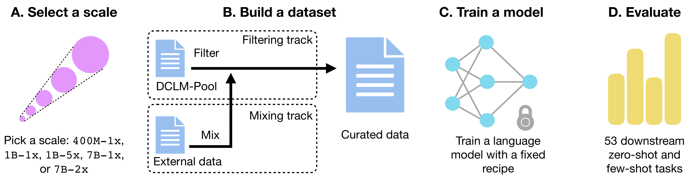

# DCLM (formerly known as DCNLP)

## Table of Contents
1. [Introduction](#introduction)
2. [Leaderboard](#leaderboard)
3. [Getting Started](#getting-started)
4. [Selecting Raw Sources](#selecting-raw-sources)
5. [Processing the Data](#processing-the-data)
6. [Tokenize and Shuffle](#tokenize-and-shuffle)
7. [Model Training](#model-training)
8. [Evaluation](#evaluation)
9. [Submission](#submission)
10. [Contributing](#contributing)
11. [License](#license)

## Introduction

DCLM (DataComp-LM) is a comprehensive framework designed for building and training large language models (LLMs) with diverse datasets. It offers a standardized corpus of over 300T unfiltered tokens from CommonCrawl, effective pretraining recipes based on the open_lm framework, and an extensive suite of over 50 evaluations. This repository provides tools and guidelines for processing raw data, tokenizing, shuffling, training models, and evaluating their performance. 

DCLM enables researchers to experiment with various dataset construction strategies across different compute scales, from 411M to 7B parameter models. Our baseline experiments show significant improvements in model performance through optimized dataset design.

**Submission workflow**:
* **(A)** A participant chooses a scale, where larger scales reflect more target training tokens and/or model parameters. _Imo it is unclear why there is a 1x behind 1B but a 2x behind 7B_

* **(B)** A participant filters a pool of data (filtering track) or mixes data of their own (bring your own data track) to create a dataset.

* **(C)** Using the curated dataset, a participant trains a language model, with standardized training code and scale-specific hyperparameters, which is then **(D)** evaluated on 53 downstream tasks to judge dataset quality.


For more details, please refer to our [paper](https://placeholder-link-to-paper.com).

## Getting Started
To get started with DCLM, follow these steps:

1. **Clone the repository**:
    ```bash
    git clone https://github.com/your-repo/DCLM.git
    cd DCLM
    ```

2. **Install dependencies**:
    ```bash
    pip install -r requirements.txt
    ```

3. **Set up your environment**:
    DCLM uses AWS for storage and possible as a compute backend, and ray for distributed processing.
    Ensure you have the necessary environment variables and configurations for AWS and Ray clusters.

## Selecting Raw Sources
If you are creating a rnew aw source:

- Ensure your data is stored in JSONL format (ideally compressed with zstandard).
- Key names should be consistent with those in [here](baselines/core/constants.py).
- Create a reference JSON in [exp_data/datasets/raw_sources](exp_data/datasets/raw_sources).

If you are selecting a raw source for downstream processing:

- Identify the raw source you intend to use, which corresponds to a dataset reference (i.e., a JSON in [raw_sources][exp_data/datasets/raw_sources]).
- The reference JSON contains the URL to the actual data and other metadata used as input for downstream processing.

## Processing the Data
To process raw data, follow these steps:

1. **Define a set of processing steps**:
    Create a pipeline config YAML file specifying the operations.
    See our [reproduction of C4 for example](baselines/baselines_configs/c4.yaml). 
    Further details on defining a pipeline can be found [here](baselines/README.md).

2. **Launch a Ray cluster**:
    Use an appropriate Ray cluster based on the size of your dataset and specific YAML configurations.

3. **Run the processing script**:
    ```bash
    ray attach <your_cluster_config>
    cd dcnlp
    export PYTHONPATH=$(pwd)
    python3 ray_processing/process.py --source_ref_paths <source_json> --readable_name <name> --output_dir <s3_output_dir> --config_path <config_yaml> --source_name <source_name>
    ```

4. **Monitor and tear down**:
    Track progress via the `global_stats.jsonl` file in the output directory and ensure to tear down your cluster after processing.

## Tokenize and Shuffle
To convert raw text into tokenized datasets and perform shuffling:

1. **Set up a Ray cluster**:
    Follow similar steps as processing, but use [ray_processing/cluster_tokenize_shuffle.yaml](ray_processing/cluster_tokenize_shuffle.yaml).

2. **Run the tokenize and shuffle script**:
    ```bash
    python ray_processing/tokenize_shuffle.py --source_ref_paths <source_jsons> --readable_name <name> --output <s3_output_dir> --content_key text --do_sample --default_dataset_yaml <mixing_yaml>
    ```

## Model Training
To train a model using the tokenized dataset:

1. **Run the training script**:
    ```bash
    torchrun --nproc-per-node 8 -m training.train --scale <scale> <tokenized_json> --logs <log_dir> [--remote-sync <s3_bucket>] [--chinchilla-multiplier <multiplier>] [--clean-exp] [--report-to-wandb]
    ```

2. **Monitor and manage your training jobs**:
    Use slurm sbatch scripts or Sagemaker for running experiments on various compute infrastructures.

## Evaluation
Evaluate trained models using the following methods:

1. **Preferred Method**:
    ```bash
    python tools/eval_expdb.py --start_idx 0 --end_idx 3 --filters name=<filter> --prefix_replacement <prefix_replacement> --num_gpus 8 --output_dir <s3_output_dir> --eval_yaml <eval_yaml>
    ```

2. **Direct Evaluation**:
    ```bash
    torchrun --nproc_per_node <num_gpus> eval/eval_openlm_ckpt.py --checkpoint <checkpoint> --eval-yaml <eval_yaml> --config <model_params_file> --model <open_lm_config> --output-file <output_file_path>
    ```

## Submission
When you have finsihed training and evaluating your model, you should have a model eval json file unde [exp_data/evals](exp_data/evals). 
You can now open a pull request to the main repository to share your results with the team and submit it to the leaderboard.

## Contributing
We welcome contributions to improve the DCLM framework. Please follow our guidelines for submitting pull requests and reporting issues.

## License
This project is licensed under the MIT License. See the LICENSE file for details.

**TODO** explain about creating manifests
**TODO** Link to our models and datasets
**TODO** Acknowledge the team members